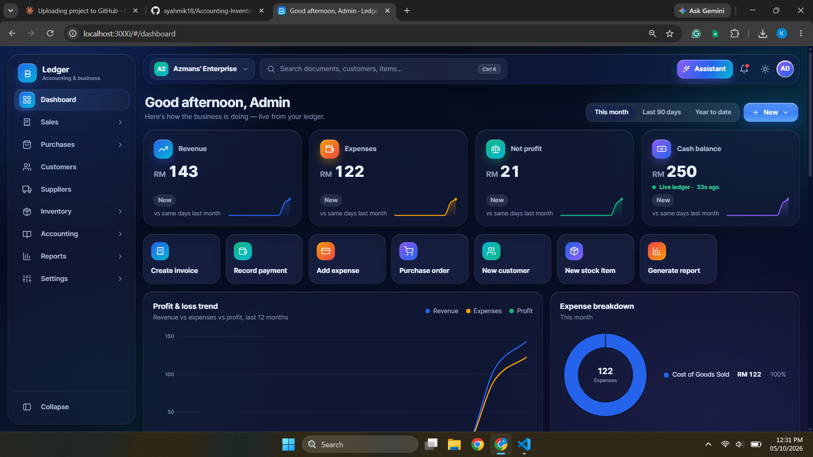
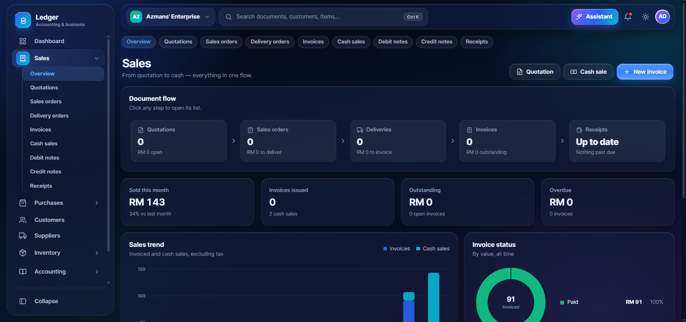
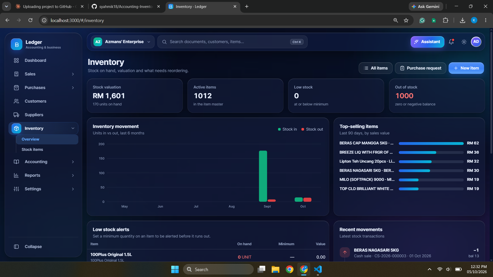
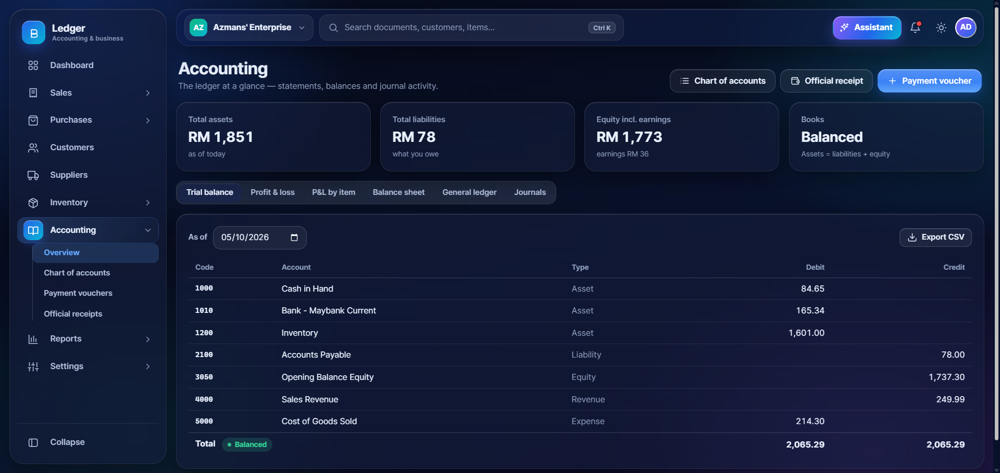

# Accounting & Inventory System

A from-scratch **double-entry accounting system** built with Node.js, Express and PostgreSQL, with a vanilla-JS single-page UI. Its module structure (GL, sales, purchases, stock, cash book) is loosely inspired by SQL Accounting.

> **Status:  Built as a learning project to explore how accounting software keeps its books consistent. Not affiliated with or endorsed by SQL Accounting / E Stream MSC.

## Screenshots

| Dashboard | Sales invoice |
|---|---|
|  |  |

| Stock master | Reports |
|---|---|
|  |  |

## What it does

- Double-entry General Ledger with one central `postJournal()` function; debits must equal credits
- Sales: quotation, delivery order, invoice, credit/debit notes, cash sale, receipts
- Purchases: request, order, goods received note, invoice, cash purchase, payments
- Stock items with FIFO, Average and Fixed costing and inventory accounting
- Cash book (payment vouchers / official receipts)
- Tax codes (SST), multi-company (one Postgres database per company), login
- Dashboard and reports (trial balance, charts)

## Design notes

- All money columns are `NUMERIC`, never floats
- Business document and its journal are saved in a single DB transaction
- A database trigger re-checks that every posted journal balances
- Fiscal periods gate posting

More detail is in [`docs/`](docs/) (start with `docs/README.md`).

## Tech stack

Node.js, Express, PostgreSQL (`pg`), plain HTML/CSS/JS frontend (no build step)

## Getting started

Requirements: Node.js 18+ and PostgreSQL 13+.

```bash
git clone https://github.com/<your-username>/<repo-name>.git
cd <repo-name>
npm install

# Database connection (defaults shown)
export PGHOST=localhost PGPORT=5432 PGUSER=postgres PGPASSWORD=postgres
export PGDATABASE=accounting_sample

createdb accounting_sample
npm run db:init        # loads db/schema.sql
# then apply db/migrations/*.sql in numeric order

npm start              # http://localhost:3000
npm run seed:demo -- --yes   # optional: fictional demo data (server must be running)
```

Default login for a new company is user `ADMIN`, password `ADMIN`. **Change it, and never expose this app to the internet as-is.**

## Known limitations

- Proof of concept: expect rough edges and incomplete features
- Sessions are held in memory (restarting the server logs everyone out)
- Single built-in ADMIN user, no role-based permissions
- Setup requires applying migrations manually

## License

Add a license file before sharing widely (MIT is a common choice for sample projects).
